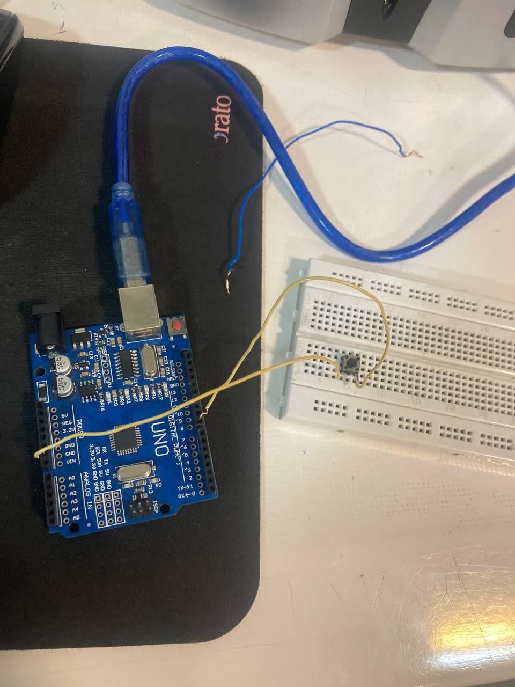

عنوان آزمایش : برنامه ای بنویسید که اگر پوش باتن روی پایه ۸ را فشار دهید ال ای دی پایه ۱۳ روشن شود و در غیر این صورت خاموش شود

ابزار و تجهیزات:پوش باتن ، برد بورد ، برد  آردینو

هدف آزمایش : روشن و خاموش شدن توسط پوش باتن

شرح آزمایش

بخش مدار :

یکی از پایه های پوش باتن را به پایه ۸ آردینو و پایه دیگر آن را به زمین وصل میکنیم

  

بخش مدار

```cpp
int ledPin = 8; // شماره پین LED
int val; // متغیر برای ذخیره مقدار خوانده شده

void setup() {
    pinMode(LED_BUILTIN, OUTPUT); // تنظیم پین LED_BUILTIN به عنوان خروجی
    pinMode(ledPin, INPUT); // تنظیم پین ledPin به عنوان ورودی
}

void loop() {
    val = digitalRead(ledPin); // خواندن مقدار از پین ledPin
    digitalWrite(LED_BUILTIN, val); // نوشتن مقدار خوانده شده به پین LED_BUILTIN
}
```
نتیجه گیری : با فشاردن پوش باتن ال ای دی پایه ۱۳ شروع به چشمک زدن میکند